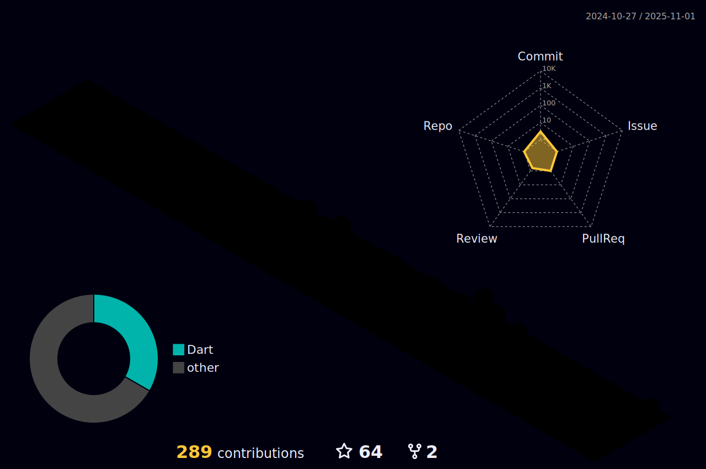

 

---

- 🔭 I’m currently working on Python app

- 🌱 I’m currently learning concurrent programming in golang

- 👯 I’m looking to collaborate on Skype, Telegram

- 💬 Ask me about python(Django,FastApi), php(Laravel), javascript || typescript (Vue, React, nestjs), go(fiber)
<!-- [](https://github.com/merlinemris/github-readme-stats) -->
<!--  -->

[](https://git.io/streak-stats)

---
## My Skill Set

<table><tr><td valign="top" width="33%">

### Frontend

<div align="center">  
  
  
  
  
  
 
          

          
</div>

</td><td valign="top" width="33%">

### Backend

<div align="center">  
  
  
  


          
</div>

</td><td valign="top" width="33%">

### DevOps

<div align="center">  
  
  
  
  

          
</div>

</td></tr></table>

<br/>


<!--  -->


<!--START_SECTION:waka example-->

```rust
From: 25 August 2021 - To: 19 September 2023

Total Time: 689 hrs 34 mins

Vue.js                     519 hrs 5 mins  >>>>>>>>>>>>>>>>>>>------   74.31 %
TypeScript                 45 hrs 33 mins  >>-----------------------   06.52 %
Python                     45 hrs 30 mins  >>-----------------------   06.52 %
JavaScript                 41 hrs 9 mins   >------------------------   05.89 %
Other                      8 hrs 58 mins   -------------------------   01.29 %
```

<!--END_SECTION:waka example-->


<br/>

## Connect with me

<div align="center">
<a href="https://github.com/MerlinEmris" target="_blank">

</a>
<a href="https://twitter.com/marylydev" target="_blank">

</a>
<a href="https://dev.to/merlinemris" target="_blank">

</a>
<a href="https://codepen.io/merlinemris" target="_blank">

</a>
<a href="https://www.linkedin.com/in/merdan4yarov/" target="_blank">

</a>
<a href="https://www.instagram.com/" target="_blank">

</a>  
</div>
